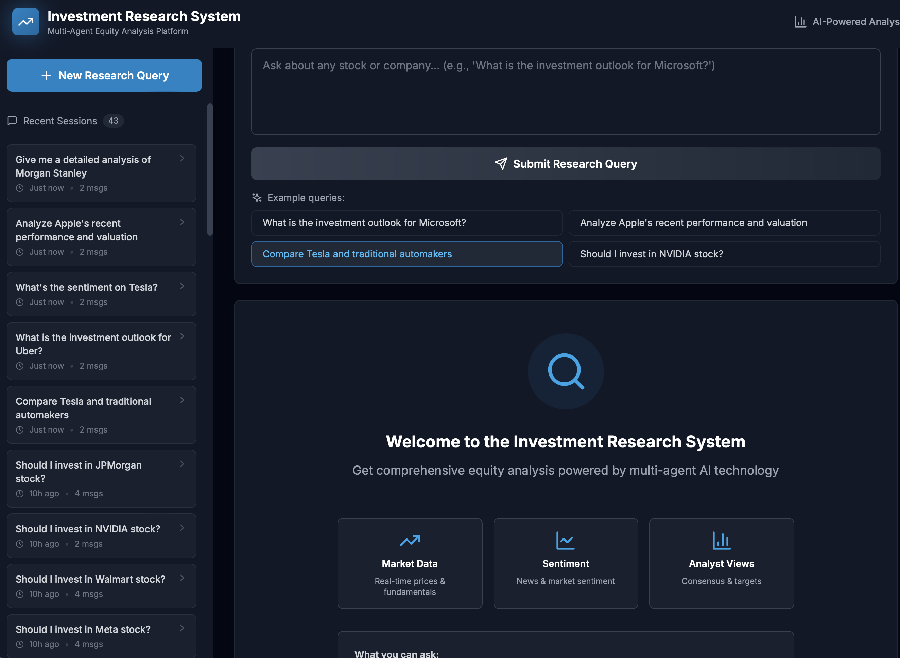
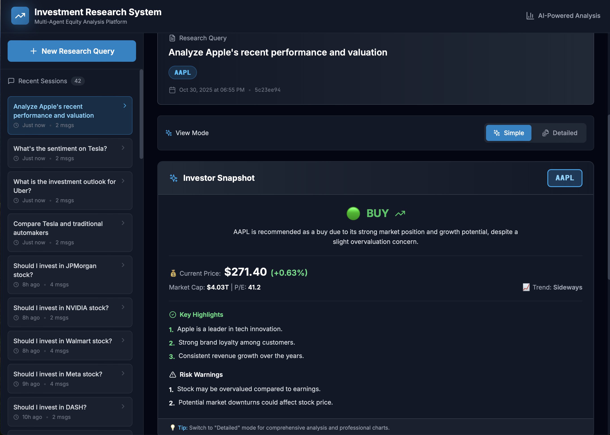
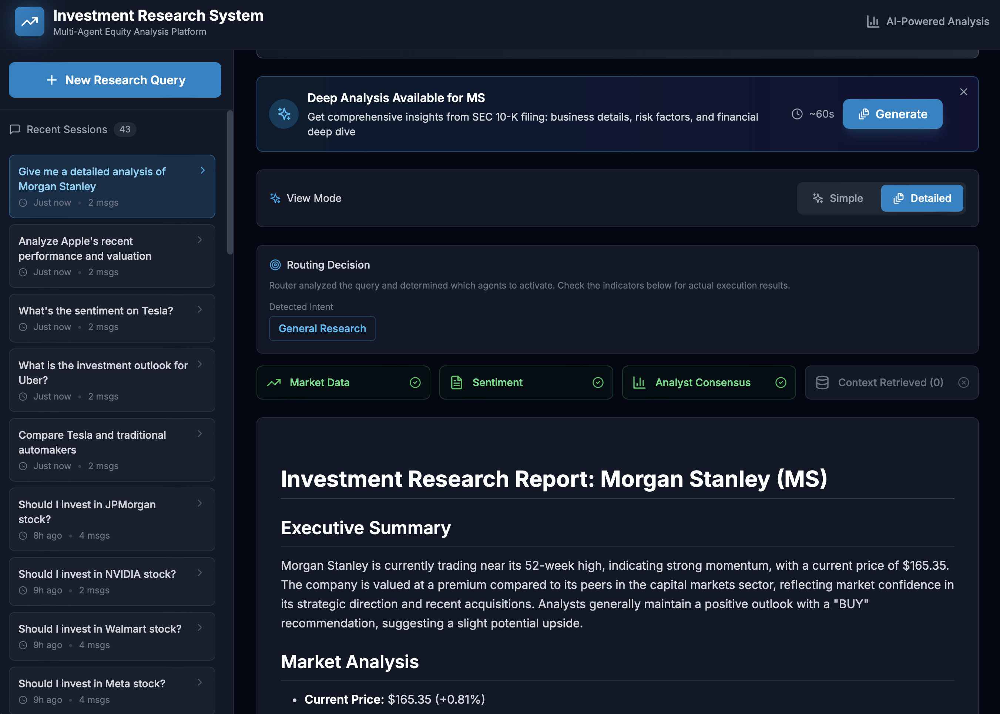
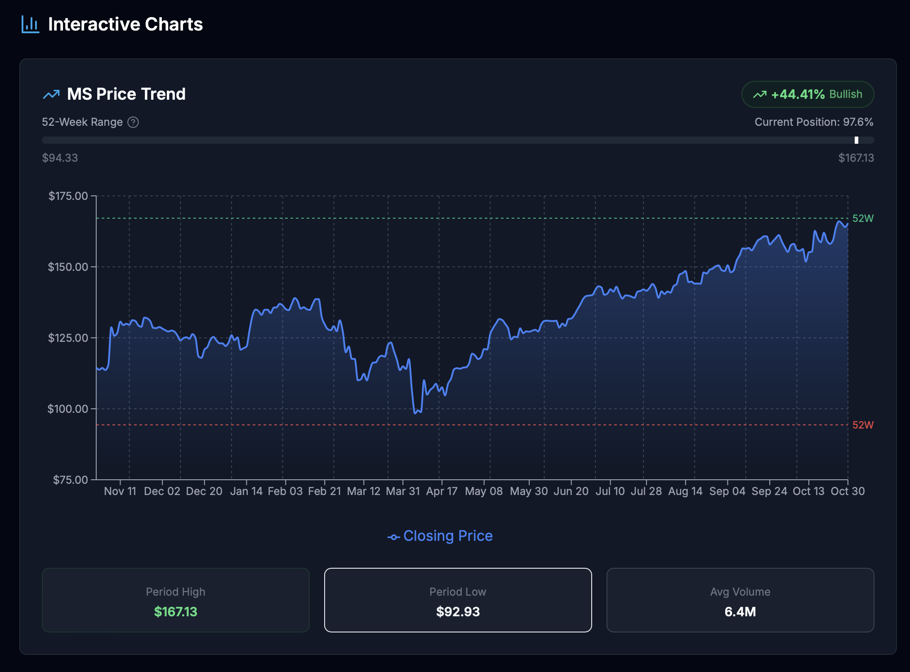
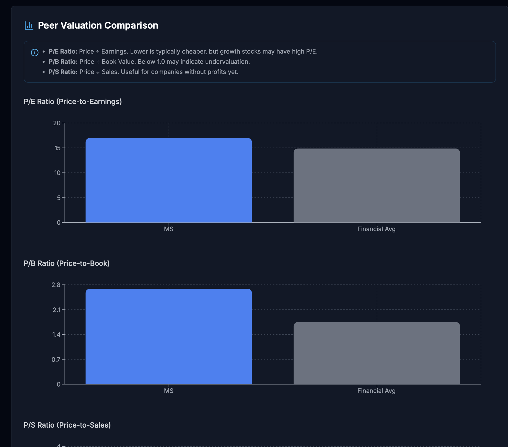

# Multi-Agent Investment Research Platform

AI-powered equity research platform that generates comprehensive investment reports using multi-agent orchestration, RAG, and real-time financial data.


---


## Screenshot










<details>
<summary>📎 More Screenshots(Interactive Charts)</summary>





</details>


## 🚀 What It Does

Ask any investment question in natural language:

- **English**: "What is the investment outlook for Microsoft?"
- **中文**: "微软的投资前景如何？"

Get a comprehensive report with:

- Real-time market data & 52-week trends
- Sentiment analysis from news
- Analyst consensus & price targets
- Peer valuation comparison (11 sectors)
- EDGAR SEC filings context

---

## ⚡ Quick Start

### 1. Prerequisites

- Python 3.11+
- Node.js 18+
- OpenAI API key ([Get one here](https://platform.openai.com/api-keys))
- MongoDB

### 2. Setup

```bash
# Clone repository
git clone <your-repo-url>
cd multi-agent-investment

# Create and activate virtual environment
python -m venv .venv
source .venv/bin/activate  # On Windows: .venv\Scripts\activate

# Install Python dependencies
pip install -r requirements.txt

# Install frontend dependencies
cd frontend
npm install
cd ..
```

### 3. Configure Environment Variables


```bash
# Copy template
cp .env.template .env

# Edit .env and add your credentials:
# - OPENAI_API_KEY: Your OpenAI API key
# - MONGODB_URI: Your MongoDB connection string
```

**Required Environment Variables:**

- `OPENAI_API_KEY` - OpenAI API key for GPT-4o and embeddings
- `MONGODB_URI` - MongoDB connection string
- `MONGODB_DB_NAME` - Database name (default: investment_research)
- `CHROMA_PERSIST_DIR` - Local directory for vector store (default: ./data/chroma)

### 4. Initialize Databases

```bash
python -m backend.scripts.init_db
python -m backend.scripts.init_ticker_cache
```

### 5. Run the Application

```bash
# Backend (Terminal 1)
uvicorn backend.main:app --reload --port 8000

# Frontend (Terminal 2)
cd frontend && npm install && npm run dev
```

**Access**:

- Frontend: http://localhost:3000
- API: http://localhost:8000/docs

---

## 💡 Core Features

✅ **Multi-Agent Workflow** - LangGraph orchestration (router, market data, sentiment, report)  
✅ **Real-time Data** - Yahoo Finance, SEC EDGAR, financial news  
✅ **Smart Analysis** - 52-week trends, peer valuation, analyst consensus  
✅ **RAG Pipeline** - ChromaDB vector search for EDGAR filings  
✅ **Bilingual** - Auto-detects language (EN/CN)  
✅ **Conversation Memory** - MongoDB session history (24h TTL)  
✅ **Quality Assurance** - Automatic report reflection & refinement (up to 3 iterations)  
✅ **Explainable AI** - Reasoning chain tracking for all agents  
✅ **Smart Retry** - Automatic recovery from transient API errors  

---

## 🛠️ Technology Stack

| Component    | Technology                      |
| ------------ | ------------------------------- |
| Backend      | FastAPI, Python 3.11+           |
| Multi-Agent  | LangGraph, LangChain            |
| LLM          | OpenAI GPT                      |
| Databases    | MongoDB, ChromaDB               |
| Frontend     | React, TypeScript, Tailwind CSS |
| Data Sources | Yahoo Finance, SEC EDGAR        |

---


## 📝 Example Usage

### Via Frontend

1. Open http://localhost:3000
2. Type: "Analyze Apple's recent performance"
3. Get comprehensive report in seconds

### Via API

```bash
curl -X POST http://localhost:8000/api/research/query \
  -H "Content-Type: application/json" \
  -d '{"query": "What is the investment outlook for NVDA?"}'
```

---


## 📁 Project Structure

```
.
├── backend/
│   ├── agents/
│   ├── api/             # FastAPI REST endpoints
│   ├── memory/          # MongoDB conversation memory
│   ├── rag/             # RAG pipeline (EDGAR, news)
│   ├── services/        # Yahoo Finance, ChromaDB, Ticker Resolver
│   └── config/          # Settings & environment config
├── frontend/
│   └── src/
│       ├── components/  # React UI components
│       ├── api/         # API client
│       └── types/       # TypeScript definitions
├── data/
│   ├── chroma/          # Vector store (local)
│   ├── edgar_filings/   # Downloaded SEC filings (not in git)
│   └── ticker_cache.json # Ticker resolution cache
├── tests/               # Test suite
└── PLAN.md              # Development roadmap & progress tracking
```

---

## 🎨 Features Showcase

### 🔍 Deep Analysis Mode

- On-demand SEC 10-K filing analysis
- Automatic download and vector embedding
- Comprehensive business insights and risk analysis

### 🌐 Multi-Language Support

- Automatic language detection (English/Chinese)
- Bilingual UI and reports
- Natural query understanding

### 📊 Real-time Market Data

- Yahoo Finance integration
- 52-week price trends
- Peer sector comparison (11 sectors)
- Analyst consensus ratings

### 🤖 Advanced Agent Features

**Reflection Loop** (Generate → Reflect → Refine):
- Automatic quality evaluation (completeness, consistency, actionability, clarity)
- Iterative refinement up to 3 times for optimal report quality
- Quality threshold: 8.5/10 (88% score)

**Reasoning Chain Tracking**:
- Complete visibility into agent decision-making process
- Step-by-step reasoning logs for debugging and explainability
- Detailed execution metrics (time, attempts, success rate)

**Smart Error Handling**:
- Automatic retry with exponential backoff (1s → 2s → 4s)
- Intelligent error classification (transient vs permanent)
- Graceful degradation for partial failures

**Performance Monitoring**:
- Per-agent execution time tracking
- Token usage monitoring
- Success/failure statistics

---

## 🏗️ System Architecture

### Multi-Agent Workflow

```
User Query
    ↓
┌─────────────────────────────────────────────┐
│ Router Agent (Reasoning Chain Enabled)     │
│ • Extract tickers (dynamic resolver)       │
│ • Analyze intent                            │
│ • Set routing flags                         │
└─────────────────────────────────────────────┘
    ↓
┌─────────────────────────────────────────────┐
│ Parallel Execution (4 Agents)              │
│                                             │
│ ┌─────────────┐  ┌──────────────┐         │
│ │ Market Data │  │  Sentiment   │         │
│ │   Agent     │  │    Agent     │         │
│ └─────────────┘  └──────────────┘         │
│                                             │
│ ┌─────────────┐  ┌──────────────┐         │
│ │  Forward    │  │     RAG      │         │
│ │  Looking    │  │  Retrieval   │         │
│ └─────────────┘  └──────────────┘         │
│                                             │
│ All agents track: reasoning, metrics, retry│
└─────────────────────────────────────────────┘
    ↓
┌─────────────────────────────────────────────┐
│ Aggregator (Sync Point)                    │
└─────────────────────────────────────────────┘
    ↓
┌─────────────────────────────────────────────┐
│ Visualization Agent                         │
│ • Price history charts                      │
│ • Peer comparison data                      │
└─────────────────────────────────────────────┘
    ↓
┌─────────────────────────────────────────────┐
│ Report Agent (Reflection Loop)             │
│                                             │
│  Iteration 1:                               │
│  ┌──────────┐  ┌──────────┐  ┌──────────┐ │
│  │ Generate │→ │ Reflect  │→ │  Refine  │ │
│  └──────────┘  └──────────┘  └──────────┘ │
│                     ↓                       │
│              Quality >= 0.85?               │
│                ✓ Yes → Done                 │
│                ✗ No → Iteration 2 (max 3)   │
└─────────────────────────────────────────────┘
    ↓
Final Report + Metrics + Reasoning Chains
```

### Quality Assurance Pipeline

**Report Reflection Process**:

1. **Generate**: Create initial report from all agent data
2. **Reflect**: LLM evaluates 4 dimensions (0-10 scale each):
   - **Completeness**: Uses all available data sources
   - **Consistency**: No internal contradictions
   - **Actionability**: Clear investment insights
   - **Clarity**: Well-structured and understandable
3. **Refine**: If overall score < 8.5, regenerate with improvement feedback
4. **Iterate**: Repeat up to 3 times or until quality threshold met

**Example Quality Feedback**:
```json
{
  "completeness": 9,
  "consistency": 9,
  "actionability": 8,
  "clarity": 9,
  "overall_score": 8.8,
  "strengths": [
    "Comprehensive data integration",
    "Clear investment recommendation"
  ],
  "gaps": [
    "Missing forward-looking catalysts"
  ]
}
```


---

## 🤝 Contributing

This is a personal portfolio project demonstrating:

- Multi-agent AI systems with LangGraph
- RAG pipeline implementation
- Full-stack development (FastAPI + React)
- Financial data integration

For questions or suggestions, please open an issue or contact me at [flashtay13@gmail.com](mailto:flashtay13@gmail.com).

---

## 📄 License

This project is licensed under the MIT License - see the [LICENSE](LICENSE) file for details.

---

## 🙏 Acknowledgments

- **LangGraph & LangChain** - Multi-agent orchestration framework
- **OpenAI** - GPT for analysis and embeddings
- **Yahoo Finance** - Real-time market data
- **SEC EDGAR** - Official company filings

---

